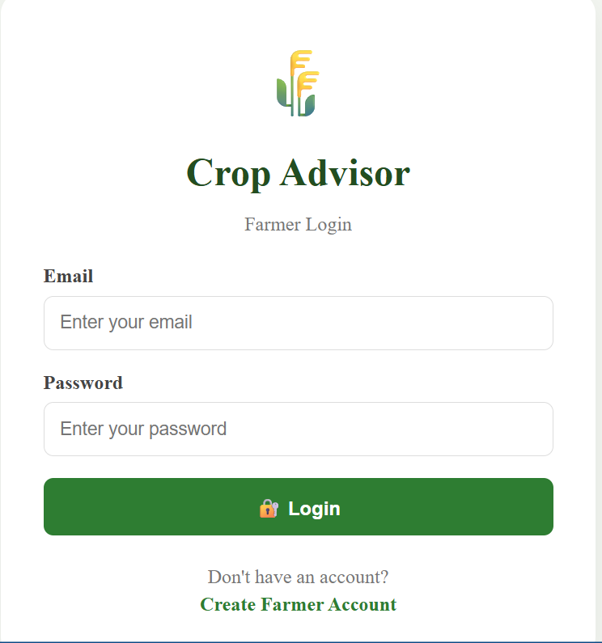

# 🌾 Smart Crop Advisory System

A web-based **Smart Crop Advisory System** .

The system helps farmers manage their farm information and receive crop recommendations based on **soil type and weather conditions**.

---

## 🚀 Features

### 👤 Farmer Authentication
- Farmer registration
- Farmer login
- Password hashing using bcryptjs
- JWT-based authentication

### 🌾 Farm Management
- Add farm details
- Store farm name
- Store crop information
- Store soil type
- Store farm area
- Store farm location
- Store latitude and longitude

### 🌦️ Weather Information
- OpenWeather API integration
- Current weather information
- Temperature-based farming information
- Location-based weather data

### 🌱 Crop Advisory
- Soil-based crop recommendation
- Temperature-based recommendation
- Basic agricultural advisory
- Crop recommendation using rule-based logic

---

## 🛠️ Technologies Used

### Frontend
- React.js
- Vite
- React Router
- Axios
- CSS

### Backend
- Node.js
- Express.js
- MongoDB
- Mongoose
- JWT
- bcryptjs
- dotenv
- CORS

### API
- OpenWeather API

---

## 🏗️ System Architecture

```text
              👨‍🌾 Farmer
                  │
                  ▼
        ┌──────────────────┐
        │ React Frontend   │
        │      Vite        │
        └────────┬─────────┘
                 │
                 │ Axios / HTTP
                 ▼
        ┌──────────────────┐
        │ Express Backend  │
        │    Node.js       │
        └───────┬──────────┘
                │
        ┌───────┴────────┐
        │                │
        ▼                ▼
 ┌─────────────┐  ┌───────────────┐
 │   MongoDB   │  │ OpenWeather   │
 │  Database   │  │      API      │
 └─────────────┘  └───────┬───────┘
                           │
                           ▼
                  🌱 Crop Advisory
### 👤 Login / Registration



